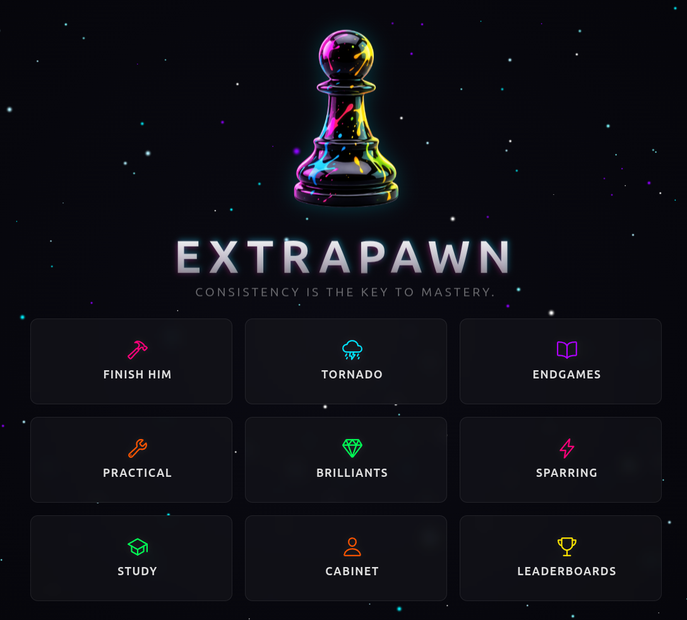

# ♟️ extrapawn.com — The Chess Gym for Serious Players

**Bridge the gap between amateur play and Grandmaster-level preparation with a professional-grade training ecosystem.**

**extrapawn.com** is a closed-loop interactive platform designed for tournament players (1500+) who seek a disciplined training environment. We combine deep engine-backed analysis with realistic, human-like AI sparring to transform chess study into a repeatable, high-impact skill.

  

---

## 🚀 The Vision: A Full-Fledged Chess Gym

Most chess platforms focus on casual play or disconnected puzzles. **extrapawn.com** is different. We provide a **closed-loop training cycle**:
1.  **Build your weapon** in the STUDY laboratory.
2.  **Test it in sparring** against rating-specific human-like AI.
3.  **Hone the realization** of gained advantages.
4.  **Analyze weaknesses** in your interactive dashboard.
5.  **Fix and repeat** until mastery.

---

## 💎 Flagship Modules

### 🔬 STUDY — Analytical Laboratory
Your interactive command center for repertoire building.
- **Speedrun & Reply Training**: Move beyond passive reading with active recall and memory-stress training.
- **MozerBook Integration**: Leverage elite statistics and engine-verified trees to build bulletproof preparation.
- **Lichess Sync**: Two-way synchronization with your Lichess studies.

### ⚔️ OPENING SPARRING — Repertoire Simulator
Test your preparation in a realistic tournament environment.
- **Dynamic Opponents**: Bots move based on live player statistics (Lichess 1000–2200+) with adjustable variability.
- **Personality Types**: Choose between **Master** (theoretical), **Hustler** (statistical), or **Swindler** (poisonous traps).
- **Playout Transition**: Seamlessly transition from the opening to advantage realization against Maia AI.

### 💎 DIAMOND HUNTER — Brilliancy Trainer
Learn to punish typical mistakes and secure "Brilliant" achievements.
- **Hunt & Secure**: Find the "Diamond" move (`!!`), refute the bot's blunder, and **replay the entire line from memory** to lock in the knowledge.
- **Gravity Map Guidance**: Visualize tactical tension with real-time arrow-based mapping.

---

## 🎮 Training Ecosystem

| Module | Focus | Engine & Intelligence |
| :--- | :--- | :--- |
| **🌪️ Tornado** | Tactical Storm | Adaptive Glicko-2 trainer with 15 thematic vectors. |
| **⚔️ Finish Him** | Art of Realization | Master the skill of coldly finishing off won positions vs Maia. |
| **♟️ Practical** | Real-game Scenarios | Converting extra pawns and positional intuition training. |
| **📖 Theoretical** | Book Master | Master classic endgame positions against provocative engines. |
| **📊 User Cabinet** | Command Center | Rose Charts visualizing your technical DNA and progress. |

---

## 🤖 AI & Engine Architecture

Our infrastructure utilizes a distributed engine cluster to provide specialized computations for every training scenario.

| Engine | Role | Playstyle |
| :--- | :--- | :--- |
| **Stockfish 18** | Absolute Truth | Mathematically perfect, optimal for strict "best" moves. |
| **Maia (1900-2400)** | Human Sparring | Predicts moves that feel human, including realistic error patterns. |
| **LCZero** | AI Intuition | Deep neural network analysis for strategic and positional evaluation. |
| **MozerBook** | Theoretical Hub | Curated database of opening theory and statistical winrates. |

---

## 🌍 Economy & Club Integration

We operate on an **"Active-First"** model that rewards community engagement.
- **PawnCoins**: Power your high-intensity playouts and advanced repertoire generation.
- **Bonus Program**: Earn automatic tier upgrades (**Knight**, **Bishop**, **King**) by being an active member of the ExtraPawn club on Lichess.
- **Verification**: Achievements and progress are verified and linked directly to your Lichess profile.

---

## 🛠️ Technical Stack

- **Frontend**: Vue.js 3.5+ (Composition API), TypeScript (Strict), Vite, Pinia, Naive UI.
- **Backend**: NestJS (Node.js) & FastAPI (Python) distributed architecture.
- **Persistence**: Supabase (Postgres), IndexedDB (Dexie), LMDB.
- **Core Logic**: [Chessground](https://github.com/lichess-org/chessground) and [Chessops](https://github.com/niklasf/chessops).
- **Automation**: [n8n.io](https://n8n.io/) workflow orchestration.

---

## 📚 Documentation
1. [Project Overview](tech_docs/01_Project_Overview_Mission.md)
2. [Technical Stack](tech_docs/02_Technical_Stack.md)
3. [Architecture Overview](tech_docs/03_Architecture_Overview.md)
4. [Game Modes Deep-Dive](tech_docs/04_GameModes_Overview.md)

---

## ❤️ Author & Acknowledgments

**Moser** — Mechanical engineer and lifelong chess student. **ExtraPawn** represents the dream of a professional tool that empowers players to study effectively through AI and automation.

Special thanks to the [Lichess.org](https://lichess.org) team, the **Stockfish** project, **LCZero**, and **Maia Chess**.

_License: GNU General Public License v3.0 | Built for those who seek chess mastery._

