# ♟️ extrapawn.com — The Chess Gym for Serious Players

**Bridge the gap between amateur play and Grandmaster-level preparation with a professional-grade training ecosystem.**

**extrapawn.com** is a closed-loop interactive platform designed for tournament players (1500+) who seek a disciplined training environment. We combine deep engine-backed analysis with realistic, human-like AI sparring to transform chess study into a repeatable, high-impact skill.

---

## 🎨 Walkthrough & Core Features

### 0. Welcome & Central Command

#### Dashboard & Hub
The central landing space welcoming players to the gym. From here, players can seamlessly navigate between structured tactical study, daily training plans, sparring play, and the personal database.

  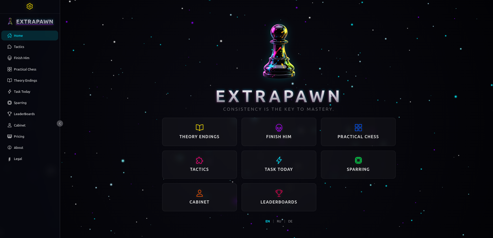

#### User Cabinet & Chess DNA
Your interactive mission control. Visual Rose Charts map out your technical DNA across opening, middle-game, and endgame themes. Spot knowledge gaps, identify recurring weaknesses, and track performance indicators over time to target exactly where your training is needed.

  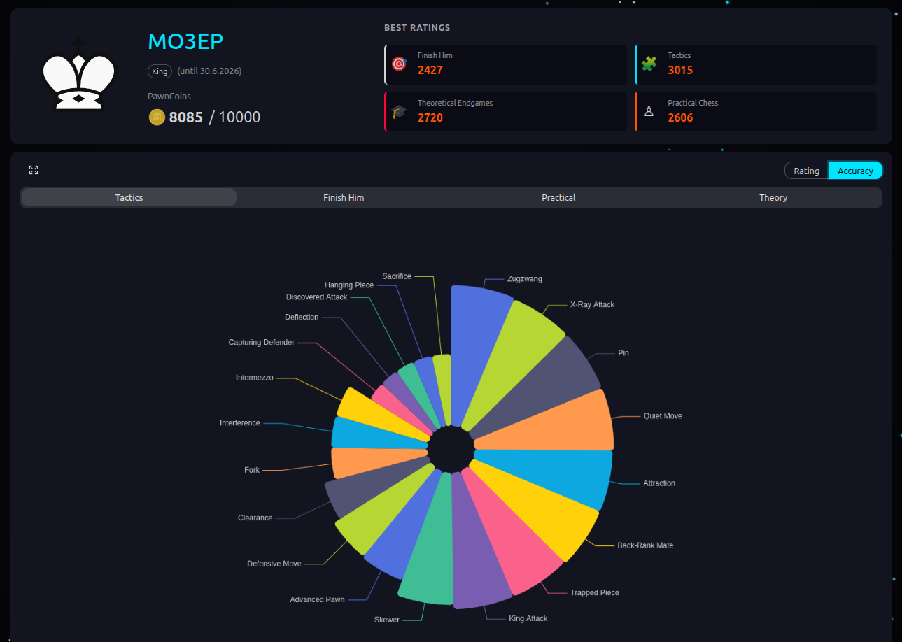

---

### 1. Pillar I: Puzzle Play (Taktik & Endspiele)
Four highly specialized study environments designed for active recall. All training puzzles are categorized into three distinct difficulty tiers (**Novice, Pro, Master**) and feature an intelligent **Coach Sidebar** on the right. The coach provides graphical indicators and warning hints to stop blunders before they happen, and can be pinned permanently for developing players.

#### Theoretical Endgames
Textbook theoretical endgame scenarios. Practice position-specific win and defense paths that must be memorized and executed flawlessly to build your theoretical foundation.

  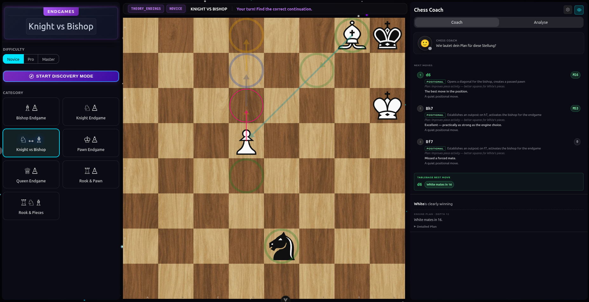

#### FinishHim
A two-phase tactical battle. Identify the tactical winning strike from a Lichess-derived game, and then transition directly into realizing the won endgame against the human-like **Maia 2200** engine. Refine your conversion technique against a opponent that defends with natural human errors rather than mechanical perfection.

  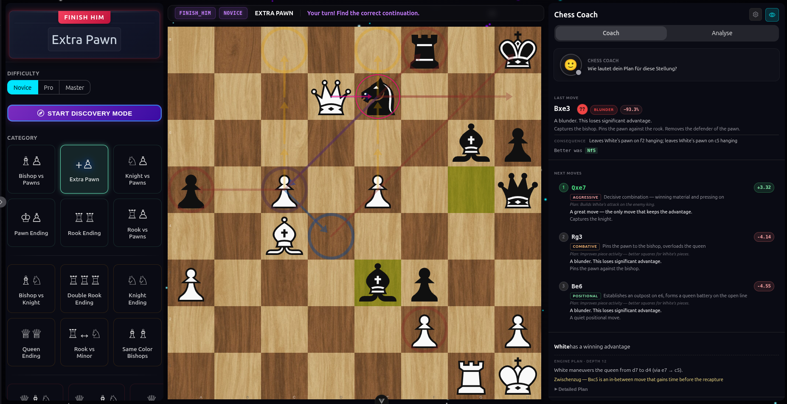

#### Practical Endgames
A compilation of 20 practical endgame structures from real tournament games. Practice converting endgames under realistic conditions where pure calculation meets positional intuition.

  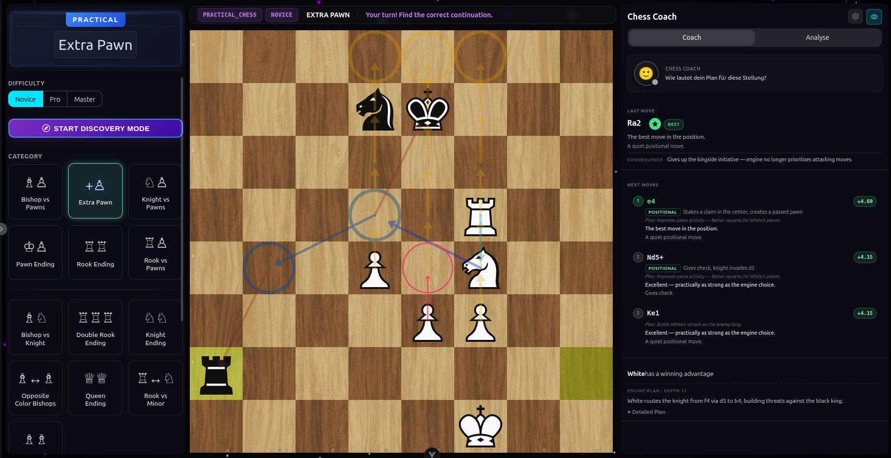

#### Tactics
The highest-quality tactical motifs extracted from Lichess puzzles, classified across 20 core strategic patterns to train your tactical vision.

  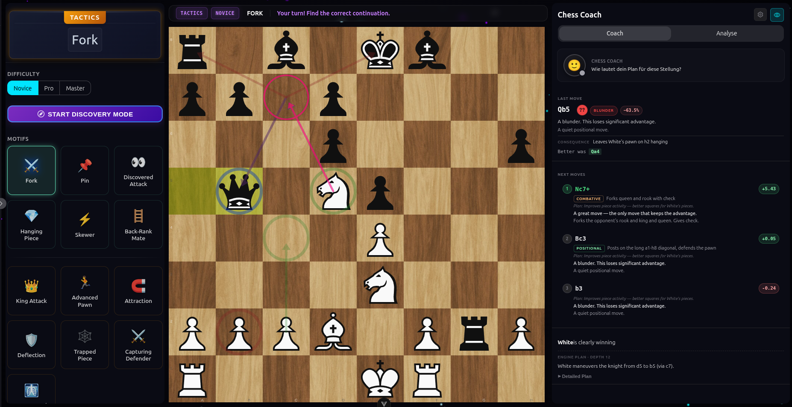

---

### 2. Pillar II: Task Today (Tägliches Training)
The ultimate instrument for daily, structured training. Generate customized puzzle sets daily using three specific strategies across three difficulties:
*   💡 **Discovery**: Learn new themes and close knowledge gaps.
*   🔥 **Hardcore**: Target and attack your biggest weaknesses where you get beaten most often.
*   ⚡ **Warmup**: Sharpen and reinforce your strongest themes.

#### Task Today Dashboard
Configure and generate your customized daily training schedule.

  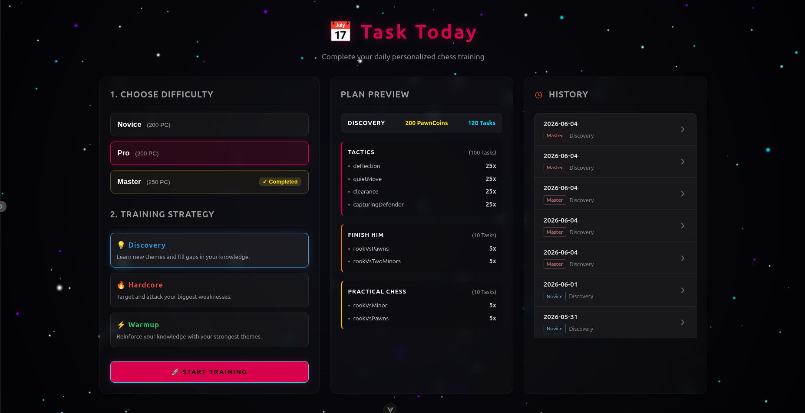

#### Active Solver Window
Solve puzzle sets under timer pressure. The system tracks your speed, accuracy, and sequence patterns in real time.

  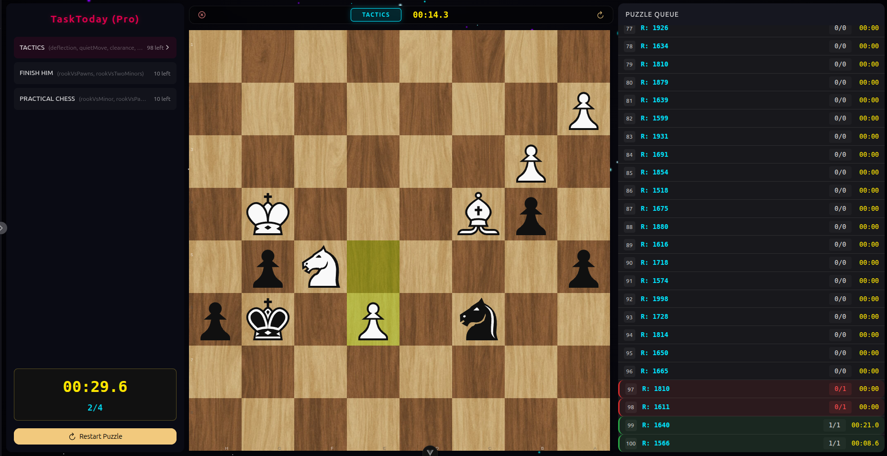

#### Performance Report
Receive a detailed analysis breakdown upon completion. Performance metrics are synced to the backend database to automatically shape future daily training plans.

  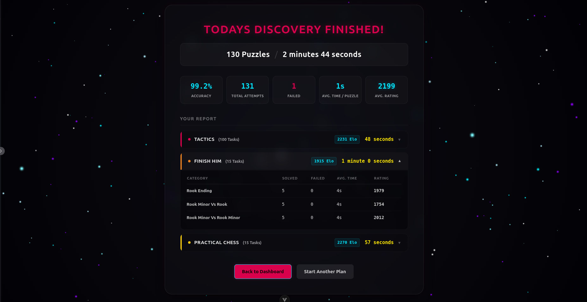

---

### 3. Pillar III: Sparring (Spielpraxis & Analyse)
Play full sparring games from the starting position or custom board configurations, backed by comprehensive end-game databases, engine support, and theory reference.

#### Interactive Sparring & Coach Sidebar
Engage in active play with the Coach Sidebar showing strategic advice, evaluation charts, and a detailed Analysis tab on the right side.

  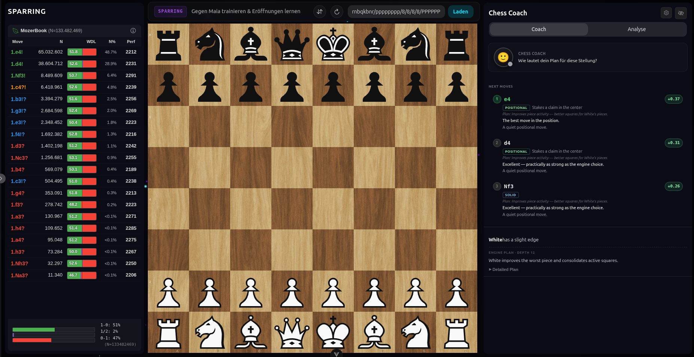

#### Opening Explorer (MozerBook)
The left-hand explorer displays opening statistics compiled from Lichess games played by players rated 2000+ Elo. Color-coded guides make exploring opening lines intuitive.

  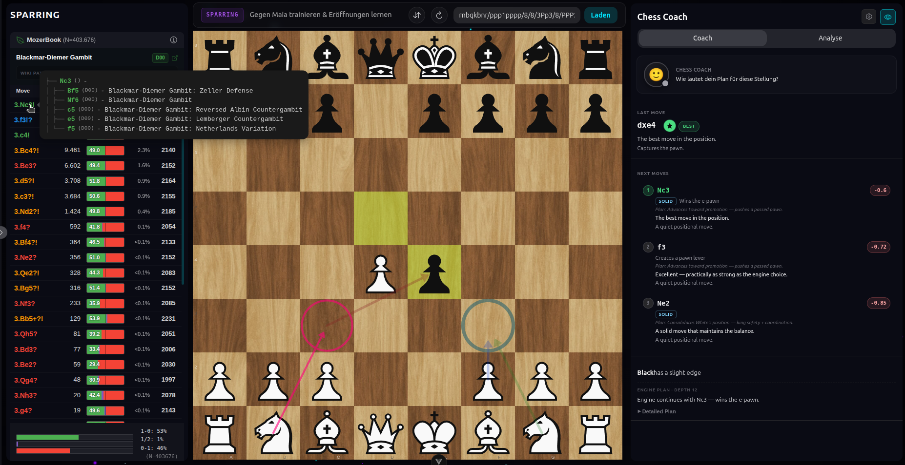

#### Wikibooks Integration
Access extensive articles, concepts, and opening theory directly matching the active board state to study the historical context and strategic motifs behind every move.

  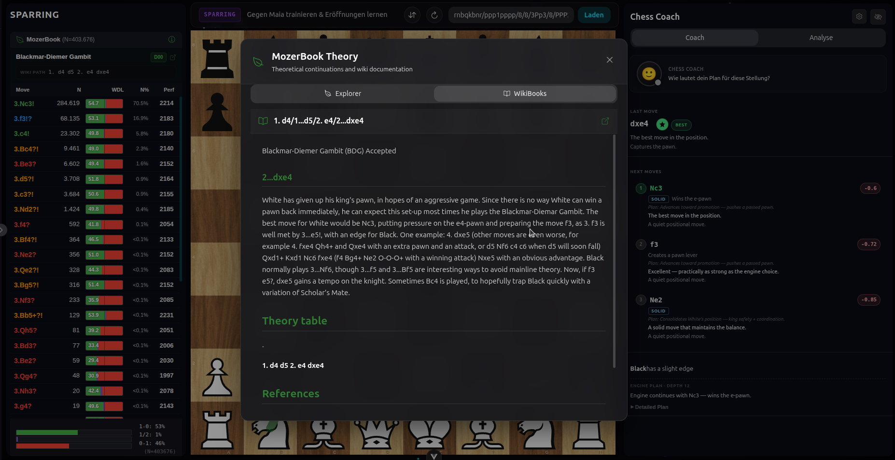

---

## 🤖 Engine & Intelligence Architecture

Our backend distributed cluster manages multiple specialized engine components:
*   **Stockfish 18**: Absolute truth engine, calculating mathematically optimal moves.
*   **Maia Chess (1900-2200+)**: Neural networks mimicking human play, perfect for training against realistic mistakes and natural defensive styles.
*   **LCZero**: Deep-learning network providing strategic positional analysis.
*   **MozerBook Database**: Statistics-based opening theory engine.

---

## 🛠️ Technical Stack

*   **Frontend**: Vue.js 3.5+ (Composition API), TypeScript (Strict), Vite, Pinia, Naive UI.
*   **Backend**: NestJS (Node.js) & FastAPI (Python) distributed microservices.
*   **Persistence**: Supabase (PostgreSQL), IndexedDB (Dexie), LMDB.
*   **Core Logic**: [Chessground](https://github.com/lichess-org/chessground) and [Chessops](https://github.com/niklasf/chessops).
*   **Workflows**: n8n automation scheduler.

---

## ❤️ Acknowledgments & Foundations

*   **Coach Sidebar Foundation**: Special thanks to [Chess Analysis Studio](https://github.com/dev-arcturus/positional_chess) by [dev-arcturus](https://github.com/dev-arcturus). We used this browser-based analysis tool as the foundation for our Coach Sidebar, expanding it with advanced graphical indicators and full backend server-side engine capabilities.
*   **Platform & Database**: Huge thanks to [Lichess.org](https://lichess.org) for their open database, APIs, and puzzle datasets.
*   **Engines**: The open-source Stockfish community, LCZero team, and Maia Chess research group.

---
_License: GNU General Public License v3.0 | Built for those who seek chess mastery._
