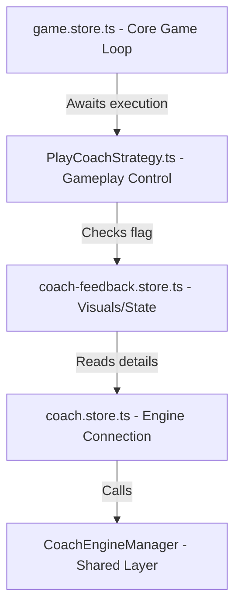

# Interaktives Chess Coach Feedback & Auto-Takeback System

Dieses Dokument fasst die Implementierung, die finale Software-Architektur, bekannte technische Schulden sowie das Übergabeprotokoll für das Coach-Feedback- und Auto-Takeback-System zusammen.

---

## 1. Übersicht & Zielsetzung
Das System gibt dem Spieler während Partien gegen Bot-Gegner visuelles und akustisches Feedback zu seinen Zügen durch einen virtuellen Schachcoach.
Ein Kern-Feature ist das **Auto-Takeback**: Spielt der Spieler einen schlechten Zug (Patzer, Fehler, Ungenauigkeit), wird dieser nach einer kurzen Verzögerung (1000 ms) automatisch zurückgenommen. Der Spieler erhält eine visuelle Verwarnung und einen akustischen Warnhinweis, um den Zug noch einmal zu überdenken.

---

## 2. Finale System-Architektur

Die Architektur folgt dem **Feature-Sliced Design (FSD)** und trennt die Spielmechanik (Gameplay) strikt von der UI/Präsentationsschicht (Feedback).

### Komponenten & Aufgabenverteilung

1. **`PlayCoachStrategy.ts` (Features - Spielsteuerung)**:
   - Orchestriert den Spielablauf (Spieler zieht $\rightarrow$ wartet auf Coach $\rightarrow$ Bot zieht).
   - Wartet synchron in `onUserMoveExecuted`, bis die Coach-Analyse abgeschlossen ist (`isAnalyzing === false`).
   - Prüft im Anschluss `feedbackStore.isTakebackPending`.
   - Bei `true`:
     - Spielt den Fehler-Sound (`game_training_error`) ab.
     - Blockiert die Ausführung für 1000 ms (`await sleep(1000)`).
     - Führt die Zugschnittstelle `gameStore.undoLastUserMove()` aus.
     - Bricht die Ausführung ab, sodass der Bot-Zug übersprungen wird.
   - Verhindert so jegliche Race Conditions bei extrem schnellen Bot-Antworten oder Cache-Treffern.

2. **`coach-feedback.store.ts` (Features - UI & Visual State)**:
   - Verwaltet den Zustand der Coach-Stimmung (`coachMood`): `neutral`, `proud`, `shocked`, `thoughtful`, `warning`, `relieved`, `celebrating`.
   - Reagiert über einen synchronen Watcher (`{ flush: 'sync' }`) auf das Ende der Coach-Analyse.
   - Setzt das Flag `isTakebackPending = true` und die entsprechende Nachricht (`takebackMessage`), falls die Zugqualität schlechter als `good` ist (`blunder`, `missed_mate`, `mistake`, `inaccuracy`).
   - Beinhaltet **keine** asynchronen Nebeneffekte (wie `setTimeout` oder Töne), um Race Conditions zu vermeiden.
   - Vergleicht FENs bei Zügen, um den Takeback-Zustand zurückzusetzen, sobald ein neuer Versuch gespielt wird.

3. **`game.store.ts` (Entities - Kern-Spiellogik)**:
   - Verwaltet den PGN-Baum und den Brettzustand.
   - Besitzt die verbesserte Funktion `undoLastUserMove()`. Diese prüft, ob der Bot bereits geantwortet hat (Turn liegt beim Spieler), und nimmt in diesem Fall **zwei Züge** (Bot-Zug + User-Blunder) zurück. Hat der Bot noch nicht gezogen, wird nur **ein Zug** zurückgenommen.

---

## 3. Implementierte Features & Funktionen

- **Dynamisches Stimmungs-System**: 
  - `thoughtful` während der Berechnung.
  - `proud` bei brillanten/großartigen Zügen.
  - `relieved` bei besten/exzellenten Zügen.
  - `warning` bei Fehlern (`mistake`) und Ungenauigkeiten (`inaccuracy`).
  - `shocked` bei groben Patzern (`blunder`, `missed_mate`).
  - `celebrating` bei Spielende (Sieg/Matt).
  - `neutral` im Standardzustand oder bei gegnerischen Zügen.
- **Auto-Takeback**: Greift bei `blunder`, `missed_mate`, `mistake` und `inaccuracy`.
- **Promotion- & Cache-Sicherheit**: Durch das synchrone Aufrufen der Watcher und die verbesserte 1/2-Zug-Rücknahme in `game.store.ts` funktionieren Takebacks auch bei schnellen Engine-Antworten (0 ms) und Umwandlungs-Promotions (`a7a8q`).
- **Sound-Isolation**: Coach-Sounds (`game_training_error`) stören die Standard-Spielgeräusche nicht und werden ausschließlich über den Strategy-Controller ausgelöst.

---

## 4. Technische Schulden (Technical Debt)

- **Asynchrone Dynamic Imports**:
  In `PlayCoachStrategy.ts` werden Stores und Services über `await import(...)` dynamisch geladen, um zirkuläre Abhängigkeiten in FSD zu umgehen. Dies führt zu kurzen Unterbrechungen der Ausführung auf Microtask-Ebene.
- **Gemeinsame Store-Zustände**:
  Die Kommunikation zwischen Gameplay-Strategie und Coach-Feedback-Store basiert auf reaktiven Flags (`isTakebackPending`). Dies erfordert, dass beide Komponenten denselben Lifecycle besitzen. Wird die Strategie gewechselt, müssen die Flags sauber zurückgesetzt werden.

---

## 5. Übergabeprotokoll (Handover Protocol)

### Wichtige Dateien
- `src/features/play-coach/model/PlayCoachStrategy.ts` — Steuerung des Spielablaufs & Takeback-Timing.
- `src/features/coach/model/coach-feedback.store.ts` — Zuweisung der Coach-Stimmungen & Nachrichten.
- `src/entities/game/model/game.store.ts` — Kern-Undo-Logik (`undoLastUserMove`).
- `src/features/coach/model/coach.store.ts` — Einstiegspunkt für die Coach-Analyse.

### Test-Szenarien für die Qualitätssicherung
1. **Normaler Spielfluss**: Mache gute Züge. Der Coach sollte nachdenklich schauen, sich anschließend freuen (z. B. `relieved` bei guten Zügen) und der Bot sollte normal antworten.
2. **Einfacher Blunder**: Mache einen absichtlichen Blunder. Der Coach muss schockiert schauen (`shocked`), ein roter Fehlerhinweis erscheint, der Sound `ErrorChpock.mp3` ertönt und der Zug wird nach 1 Sekunde zurückgenommen.
3. **Mehrfache Blunder (Loop)**: Mache einen Blunder, warte auf das Takeback und mache den exakt gleichen Blunder erneut. Der Coach muss das Takeback wiederholen. Der Bot darf auf keinen Fall dazwischenziehen.
4. **Promotion Blunder**: Ziehe einen Bauern auf die 8. Reihe zur Umwandlung, wähle Dame und erzeuge damit einen Blunder. Das System muss die Umwandlung sauber zurücknehmen, auch wenn der Bot die Dame sofort schlagen würde.
