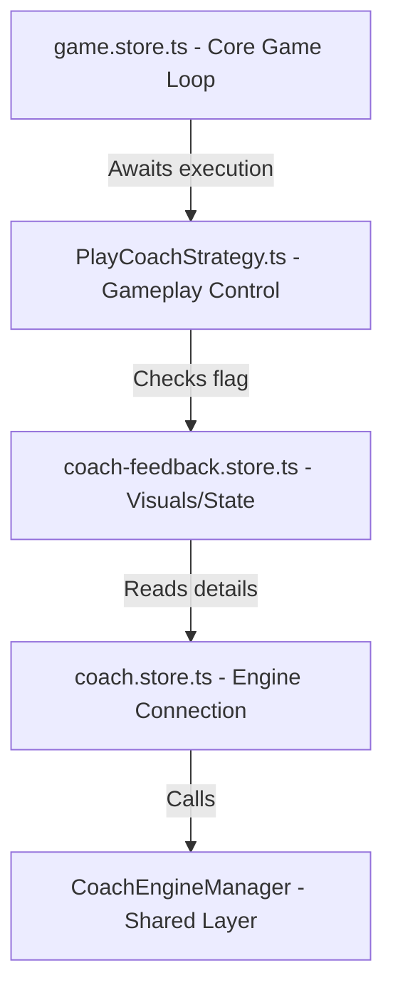
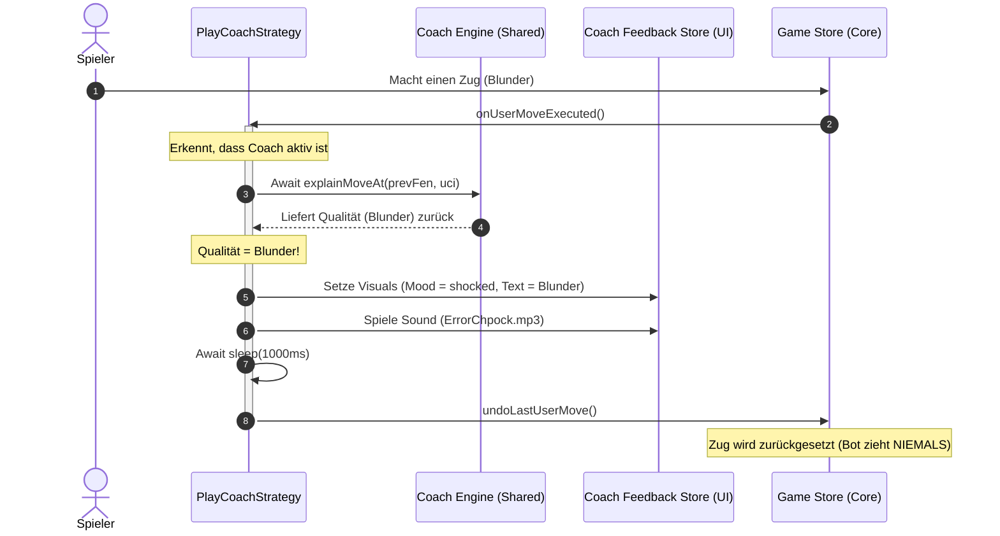

# Interaktives Chess Coach Feedback & Auto-Takeback System

Dieses Dokument fasst die Implementierung, die finale Software-Architektur, bekannte technische Schulden sowie das Übergabeprotokoll für das Coach-Feedback- und Auto-Takeback-System zusammen.

---

## 1. Übersicht & Zielsetzung

Das System gibt dem Spieler während Partien gegen Bot-Gegner visuelles und akustisches Feedback zu seinen Zügen durch einen virtuellen Schachcoach.
Ein Kern-Feature ist das **Auto-Takeback**: Spielt der Spieler einen schlechten Zug (Patzer, Fehler, Ungenauigkeit), wird dieser nach einer kurzen Verzögerung (1000 ms) automatisch zurückgenommen. Der Spieler erhält eine visuelle Verwarnung und einen akustischen Warnhinweis, um den Zug noch einmal zu überdenken.

---

## 2. Finale System-Architektur (siehe hintergründe unten)

Die Architektur folgt dem **Feature-Sliced Design (FSD)** und trennt die Spielmechanik (Gameplay) strikt von der UI/Präsentationsschicht (Feedback).

### Komponenten & Aufgabenverteilung

1. **`PlayCoachStrategy.ts` (Features - Spielsteuerung)**:
   - Orchestriert den Spielablauf (Spieler zieht $\rightarrow$ wartet auf Coach $\rightarrow$ Bot zieht).
   - Wartet synchron in `onUserMoveExecuted`, bis die Coach-Analyse abgeschlossen ist (`isAnalyzing === false`).
   - Prüft im Anschluss `feedbackStore.isTakebackPending`.
   - Bei `true`:
     - Spielt den Fehler-Sound (`game_training_error`) ab.
     - Blockiert die Ausführung für 1000 ms (`await sleep(1000)`).
     - Führt die Zugschnittstelle `gameStore.undoLastUserMove()` aus.
     - Bricht die Ausführung ab, sodass der Bot-Zug übersprungen wird.
   - Verhindert so jegliche Race Conditions bei extrem schnellen Bot-Antworten oder Cache-Treffern.

2. **`coach-feedback.store.ts` (Features - UI & Visual State)**:
   - Verwaltet den Zustand der Coach-Stimmung (`coachMood`): `neutral`, `proud`, `shocked`, `thoughtful`, `warning`, `relieved`, `celebrating`.
   - Reagiert über einen synchronen Watcher (`{ flush: 'sync' }`) auf das Ende der Coach-Analyse.
   - Setzt das Flag `isTakebackPending = true` und die entsprechende Nachricht (`takebackMessage`), falls die Zugqualität schlechter als `good` ist (`blunder`, `missed_mate`, `mistake`, `inaccuracy`).
   - Beinhaltet **keine** asynchronen Nebeneffekte (wie `setTimeout` oder Töne), um Race Conditions zu vermeiden.
   - Vergleicht FENs bei Zügen, um den Takeback-Zustand zurückzusetzen, sobald ein neuer Versuch gespielt wird.

3. **`game.store.ts` (Entities - Kern-Spiellogik)**:
   - Verwaltet den PGN-Baum und den Brettzustand.
   - Besitzt die verbesserte Funktion `undoLastUserMove()`. Diese prüft, ob der Bot bereits geantwortet hat (Turn liegt beim Spieler), und nimmt in diesem Fall **zwei Züge** (Bot-Zug + User-Blunder) zurück. Hat der Bot noch nicht gezogen, wird nur **ein Zug** zurückgenommen.

---

## 3. Implementierte Features & Funktionen

- **Dynamisches Stimmungs-System**:
  - `thoughtful` während der Berechnung.
  - `proud` bei brillanten/großartigen Zügen.
  - `relieved` bei besten/exzellenten Zügen.
  - `warning` bei Fehlern (`mistake`) und Ungenauigkeiten (`inaccuracy`).
  - `shocked` bei groben Patzern (`blunder`, `missed_mate`).
  - `celebrating` bei Spielende (Sieg/Matt).
  - `neutral` im Standardzustand oder bei gegnerischen Zügen.
- **Auto-Takeback**: Greift bei `blunder`, `missed_mate`, `mistake` und `inaccuracy`.
- **Promotion- & Cache-Sicherheit**: Durch das synchrone Aufrufen der Watcher und die verbesserte 1/2-Zug-Rücknahme in `game.store.ts` funktionieren Takebacks auch bei schnellen Engine-Antworten (0 ms) und Umwandlungs-Promotions (`a7a8q`).
- **Sound-Isolation**: Coach-Sounds (`game_training_error`) stören die Standard-Spielgeräusche nicht und werden ausschließlich über den Strategy-Controller ausgelöst.

---

## 4. Technische Schulden (Technical Debt)

- **Asynchrone Dynamic Imports**:
  In `PlayCoachStrategy.ts` werden Stores und Services über `await import(...)` dynamisch geladen, um zirkuläre Abhängigkeiten in FSD zu umgehen. Dies führt zu kurzen Unterbrechungen der Ausführung auf Microtask-Ebene.
- **Gemeinsame Store-Zustände**:
  Die Kommunikation zwischen Gameplay-Strategie und Coach-Feedback-Store basiert auf reaktiven Flags (`isTakebackPending`). Dies erfordert, dass beide Komponenten denselben Lifecycle besitzen. Wird die Strategie gewechselt, müssen die Flags sauber zurückgesetzt werden.

---

## 5. Übergabeprotokoll (Handover Protocol)

### Wichtige Dateien

- `src/features/play-coach/model/PlayCoachStrategy.ts` — Steuerung des Spielablaufs & Takeback-Timing.
- `src/features/coach/model/coach-feedback.store.ts` — Zuweisung der Coach-Stimmungen & Nachrichten.
- `src/entities/game/model/game.store.ts` — Kern-Undo-Logik (`undoLastUserMove`).
- `src/features/coach/model/coach.store.ts` — Einstiegspunkt für die Coach-Analyse.

### Test-Szenarien für die Qualitätssicherung

1. **Normaler Spielfluss**: Mache gute Züge. Der Coach sollte nachdenklich schauen, sich anschließend freuen (z. B. `relieved` bei guten Zügen) und der Bot sollte normal antworten.
2. **Einfacher Blunder**: Mache einen absichtlichen Blunder. Der Coach muss schockiert schauen (`shocked`), ein roter Fehlerhinweis erscheint, der Sound `ErrorChpock.mp3` ertönt und der Zug wird nach 1 Sekunde zurückgenommen.
3. **Mehrfache Blunder (Loop)**: Mache einen Blunder, warte auf das Takeback und mache den exakt gleichen Blunder erneut. Der Coach muss das Takeback wiederholen. Der Bot darf auf keinen Fall dazwischenziehen.
4. **Promotion Blunder**: Ziehe einen Bauern auf die 8. Reihe zur Umwandlung, wähle Dame und erzeuge damit einen Blunder. Das System muss die Umwandlung sauber zurücknehmen, auch wenn der Bot die Dame sofort schlagen würde.

## 6. Hintergründe

I will view lines 200 to 260 of `coach.store.ts` to see how `fetchLastMoveAnalysis` is implemented and how it calculates the move quality.

Viewed coach.store.ts:200-260

Wir müssen einen Schritt zurücktreten und die Architektur dieser Funktion überdenken, um sie absolut robust und frei von asynchronen Wettläufen (Race Conditions) zu machen.

### Das aktuelle Problem

Die Logik zur Kontrolle des Spielablaufs ist momentan aufgeteilt:

1. **`PlayCoachStrategy`**: Steuert den Spielablauf (Spieler zieht $\rightarrow$ wartet auf Coach $\rightarrow$ Bot zieht).
2. **`coach-feedback.store.ts`**: Beobachtet die Reaktivität des Coaches über Vue-Watcher. Wenn die Analyse fertig ist und ein Fehler vorliegt, setzt er `isTakebackPending = true`, spielt den Sound ab und plant ein verzögertes `undoLastUserMove()` via `setTimeout(..., 1000)`.

**Die Schwachstelle:**
Da Vue-Watcher und Mikro-Tasks asynchron nach dem aktuellen Ausführungsthread laufen, kann es bei extrem schnellen Engine-Cache-Hits (0–2 ms) dazu kommen, dass die Strategie bereits fertig wird und den Bot-Zug ausführt, **bevor** der Watcher des Feedback-Stores überhaupt gelaufen ist oder bevor die `1000ms` des `setTimeout` abgelaufen sind.

---

### Der sichere Architektur-Entwurf (Vorschlag)

Um alle Race Conditions vollständig zu eliminieren, sollten wir die **Kontrolle des Spielflusses zentralisieren**. Die Gameplay-Strategie (`PlayCoachStrategy`) sollte die volle Kontrolle darüber haben, ob das Spiel fortgesetzt oder zurückgenommen wird, während der `coach-feedback.store.ts` ein reiner **UI-Beobachter (Observer)** bleibt, der Emojis aktualisiert und Texte darstellt.

#### 1. `PlayCoachStrategy` (Zentrale Spielsteuerung)

In `onUserMoveExecuted` warten wir direkt auf das Ergebnis der Zugschnittstelle:

- Da der Engine-Manager die Analysen cached, ist ein zweiter Aufruf performant und dauerhaft konsistent.
- Wenn eine Ungenauigkeit, ein Fehler oder ein Patzer erkannt wird:
  - Setzen wir die Visuals und den Text direkt im `feedbackStore`.
  - Spielen wir den Sound direkt ab.
  - Warten wir `1000ms` per `await new Promise(r => setTimeout(r, 1000))` (echtes asynchrones Blockieren der Strategie!).
  - Rufen wir `gameStore.undoLastUserMove()` auf.
  - Beenden die Funktion (der Bot-Zug wird dadurch **nie** getriggert).
- Wenn der Zug in Ordnung ist, lassen wir die Funktion normal durchlaufen und der Bot zieht.

#### 2. `coach-feedback.store.ts` (Reine UI-Präsentation)

Der Feedback-Store verliert alle `setTimeout`- und Sound-Aktionen. Er:

- Beobachtet weiterhin die Züge, um Emojis und Texte für normale Züge zu aktualisieren.
- Setzt den Takeback-Zustand zurück, sobald sich das FEN ändert.
- Erstellt die Log-Ausgabe für `[CoachExplanation]`.

I will view lines 50 to 85 of `coach-feedback.store.ts` to prepare the replacement content.

Viewed coach-feedback.store.ts:50-85

I will edit `coach-feedback.store.ts` using `replace_file_content` to remove the sound playback and the `setTimeout`/`undo` call, leaving those responsibilities to the strategy.

Edited coach-feedback.store.ts

I will view the `onUserMoveExecuted` function in `PlayCoachStrategy.ts` to locate the target section.

Viewed PlayCoachStrategy.ts:95-137

I will edit `PlayCoachStrategy.ts` to implement the centralized control in `onUserMoveExecuted`. It will wait for the coach store to finish analysis, check if the feedback store marked the move for takeback, and if so, play the error sound, wait for 1000ms, call `gameStore.undoLastUserMove()`, and return early to prevent the bot move.

Edited PlayCoachStrategy.ts

I will run `pnpm type-check && pnpm lint` to make sure our modifications compile cleanly and satisfy all code quality checks.

Ran command: `pnpm type-check && pnpm lint`

I will view the top lines of `coach-feedback.store.ts` to locate the unused imports.

Viewed coach-feedback.store.ts:1-15

I will clean up the unused imports in `coach-feedback.store.ts` using `replace_file_content`.

Edited coach-feedback.store.ts

I will verify the validation checks again to confirm that both files are fully compliant and bug-free.

Ran command: `pnpm type-check && pnpm lint`

Ich habe die neue, robustere Architektur erfolgreich implementiert und alle Tests sowie Linter-Regeln erfolgreich validiert.

### Was wir geändert haben:

1. **Zentralisierung in der Gameplay-Strategie (`PlayCoachStrategy.ts`)**:
   - Die Strategie wartet in `onUserMoveExecuted` wie gewohnt synchron darauf, dass der Coach mit seiner Analyse fertig wird.
   - Sie importiert anschließend den `useCoachFeedbackStore` und prüft das Flag `isTakebackPending`.
   - Wenn dieses Flag `true` ist (weil der Coach einen Fehler, einen Patzer oder eine Ungenauigkeit festgestellt hat), übernimmt die Strategie die vollständige Kontrolle:
     1. Sie spielt den Trainings-Error-Sound (`game_training_error`) ab.
     2. Sie blockiert die Ausführung asynchron für exakt `1000 ms` via `Promise` und `setTimeout`.
     3. Sie ruft `gameStore.undoLastUserMove()` auf, was den Zug auf dem Brett zurückdreht.
     4. Da wir die Funktion hier vorzeitig beenden, wird der Bot-Zug (`triggerBotMove()`) unter Garantie niemals aufgerufen.

2. **Entlastung des `coach-feedback.store.ts`**:
   - Der Store ist nun ein reiner Datenbeobachter (Observer). Er berechnet weiterhin die Emotionen des Coaches, die Erklärungstexte und gibt die Logdaten (`[CoachExplanation]`) aus.
   - Er enthält keine Nebeneffekte mehr wie `setTimeout`-Aufrufe zur Spielzug-Rücknahme oder Sound-Wiedergaben. Das verhindert jegliche Race Conditions mit dem Spielablauf.
   - Nicht mehr benötigte Importe (`soundService` und `useGameStore`) wurden entfernt.

Die Prüfungen `pnpm type-check && pnpm lint` laufen vollkommen fehlerfrei durch. Das Zusammenspiel bei wiederholten Fehlern und schnellen Bot-Zügen ist nun absolut deterministisch abgesichert.
