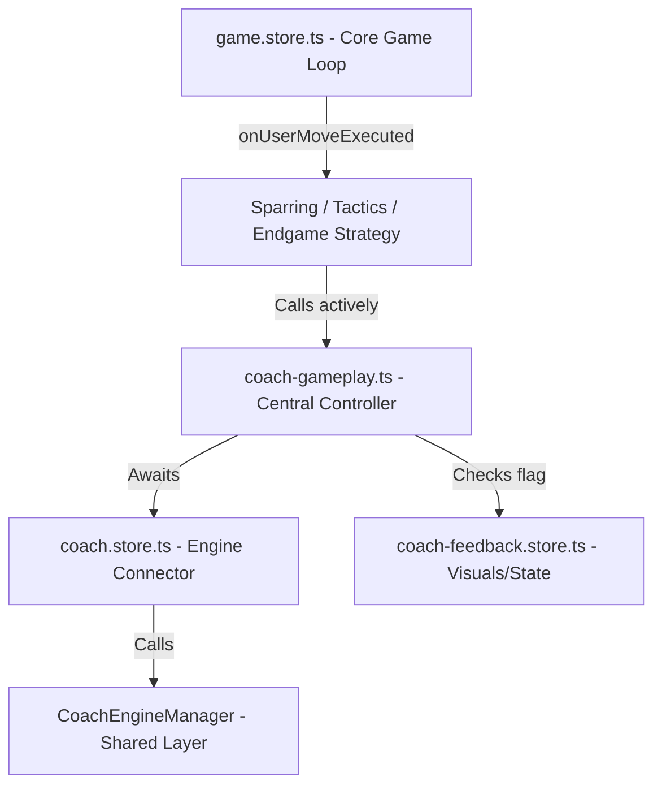

# Interaktives Chess Coach Feedback & Auto-Takeback System

Dieses Dokument fasst die Implementierung, die finale Software-Architektur, bekannte technische Schulden sowie das Übergabeprotokoll für das Coach-Feedback- und Auto-Takeback-System zusammen.

---

## 1. Übersicht & Zielsetzung

Das System gibt dem Spieler während Partien gegen Bot-Gegner sowie in Trainings-Modi (Taktiken, Endspiele) visuelles und akustisches Feedback zu seinen Zügen durch einen virtuellen Schachcoach.
Ein Kern-Feature ist das **Auto-Takeback**: Spielt der Spieler einen schlechten Zug (Patzer, Fehler, Ungenauigkeit), wird dieser nach einer kurzen Verzögerung (1000 ms) automatisch zurückgenommen. Der Spieler erhält eine visuelle Verwarnung und einen akustischen Warnhinweis, um den Zug noch einmal zu überdenken.

---

## 2. Finale System-Architektur

Die Architektur folgt dem **Feature-Sliced Design (FSD)** und trennt die Spielmechanik (Gameplay) strikt von der UI/Präsentationsschicht (Feedback).

### Komponenten & Aufgabenverteilung

1. **Zentrale Gameplay-Strategien (Features - Spielsteuerung)**:
   * **`SparringStrategy.ts`** (ehemals `PlayCoachStrategy.ts`): Steuert den freien Modus gegen Maia-2200.
   * **`TacticsPuzzleStrategy.ts`**: Steuert die Taktikaufgaben.
   * **`EndgamePuzzleStrategy.ts`**: Steuert die Endspielaufgaben.
   * Alle Strategien delegieren das Warten und Prüfen von Benutzerzügen an das zentrale Modul `coach-gameplay.ts`.

2. **`coach-gameplay.ts` (Zentrale Ablauf- & Takeback-Logik)**:
   * Kapselt die asynchrone Warteschleife auf den Coach.
   * Ruft aktiv `await coachStore.analyzeCurrentPosition()` auf. Das verhindert jegliche Race Conditions mit dem Engine-Cache und stellt sicher, dass der Thread blockiert, bis die Analyse fertiggestellt ist.
   * Prüft das Flag `isTakebackPending` im `coach-feedback.store.ts`.
   * Bei `true` (Zug war fehlerhaft):
     * Loggt die detaillierte Zugsbeurteilung (Qualität, Fehlerklasse, Winrate-Drop, Folge-Szenario, verbesserter Zug) in der Browser-Konsole.
     * Spielt den Fehler-Sound (`game_training_error`) ab.
     * Blockiert die Ausführung für 1000 ms (`await sleep(1000)`).
     * Führt das Zurücksetzen über `gameStore.undoLastUserMove()` aus.
     * Gibt `true` zurück, um der Strategie zu signalisieren, dass der Zug zurückgenommen wurde.

3. **`coach-feedback.store.ts` (Features - UI & Visual State)**:
   * Verwaltet den Zustand der Coach-Stimmung (`coachMood`): `neutral`, `proud`, `shocked`, `thoughtful`, `warning`, `relieved`, `celebrating`.
   * Reagiert über einen synchronen Watcher (`{ flush: 'sync' }`) auf das Ende der Coach-Analyse und setzt `isTakebackPending = true` sowie die Nachricht `takebackMessage`, falls die Zugqualität schlechter als `good` ist.
   * Beinhaltet keine Nebeneffekte (wie `setTimeout` oder Sound-Trigger), um Race Conditions zu vermeiden.

4. **`game.store.ts` (Entities - Kern-Spiellogik)**:
   * Verwaltet den PGN-Baum und den Brettzustand.
   * Besitzt die verbesserte Funktion `undoLastUserMove()`. Diese prüft, ob der Bot bereits geantwortet hat (Turn liegt beim Spieler), und nimmt in diesem Fall **zwei Züge** (Bot-Zug + User-Blunder) zurück. Hat der Bot noch nicht gezogen, wird nur **ein Zug** zurückgenommen.

---

## 3. Modus-Spezifisches Verhalten (Strikte Differenzierung)

Um falsche Zugs-Rücknahmen in Puzzle-Szenarien zu verhindern, wurde eine klare Unterscheidung zwischen der **Szenario-Phase** (Nachspielen der vorgegebenen Lösung) und der **Playout-Phase** (freies Weiterspielen gegen die Engine) implementiert:

### Szenario-Phase (`isPlayoutMode === false`)
* Der Gameplay-Thread blockiert **nicht** standardmäßig für Coach-Analysen, solange die korrekten Lösungszüge gespielt werden. Das sorgt für einen extrem flüssigen Spielfluss beim Lösen.
* **Erwarteter Zug gespielt**: Der Index wird erhöht. Wenn das Szenario fertig ist, gratuliert der Coach (`celebrating`). Bei `scenarioPlus` erfolgt der Übergang in die Playout-Phase.
* **Abweichender Zug gespielt**:
  1. Der Coach prüft **sofort** die Qualität des abweichenden Zuges (`await waitForCoachAndCheckTakeback()`).
  2. Ist der Zug qualitativ schlecht (Fehler): Der Coach nimmt den Zug zurück. Der Spieler verbleibt in der Szenario-Phase und muss die Taktik-Lösung weiter suchen.
  3. Ist der Zug qualitativ gut (z. B. eine starke alternative Fortsetzung):
     * Bei `scenarioPlus`: Die Abweichung wird akzeptiert, das Spiel wechselt in den Playout-Modus (`isPlayoutMode = true`) und der Spieler darf frei gegen die Engine weiterspielen.
     * Bei `scenarioOnly`: Der Zug wird zurückgenommen, da die exakte Taktik-Lösung gefunden werden muss (jedoch ohne negative Coach-Stimmung).

### Playout-Phase (`isPlayoutMode === true`)
* Der Coach bewacht jeden Zug. Jeder ungenaue oder fehlerhafte Zug führt zur automatischen Rücknahme (`waitForCoachAndCheckTakeback()`).

---

## 4. Technische Schulden (Technical Debt)

- **Asynchrone Dynamic Imports**:
  In den Strategien werden manche Stores und Services über `await import(...)` dynamisch geladen, um zirkuläre Abhängigkeiten im Features-Layer zu umgehen. Da `onUserMoveExecuted` asynchron ist, stellt dies im Gameplay-Ablauf kein Problem dar.
- **Cache-Gleichzeitigkeit**:
  Sowohl der `EnginePlayService` (Bot-Zug-Auswahl) als auch der Gameplay-Ablauf fragen den `coachEngineManager` für FEN-Analysen ab. Dank des Cache-Systems im `coachEngineManager` führt dies zu Cache-Hits und schont die Systemressourcen.

---

## 5. Übergabeprotokoll (Handover Protocol)

### Wichtige Dateien

* `src/features/coach/model/coach-gameplay.ts` — Zentrale Ablaufsteuerung & Takeback-Auslösung.
* `src/features/play-coach/model/SparringStrategy.ts` — Strategie für freies Spiel gegen Maia-2200.
* `src/features/tactics/model/TacticsPuzzleStrategy.ts` — Strategie für Taktiken.
* `src/features/endgames/model/EndgamePuzzleStrategy.ts` — Strategie für Endspiele.
* `src/features/coach/model/coach-feedback.store.ts` — Zuweisung der Coach-Stimmungen & Nachrichten.
* `src/entities/game/model/game.store.ts` — Kern-Undo-Logik (`undoLastUserMove`).
* `src/features/coach/model/coach.store.ts` — Einstiegspunkt für die Coach-Analyse.

### Test-Szenarien für die Qualitätssicherung

1. **Sparring-Modus (Freies Spiel gegen Maia-2200)**:
   * Start unter `http://localhost:5173/sparring`.
   * Mache einen schlechten Zug. Der Coach muss sofort `warning` oder `shocked` anzeigen, der Fehler-Sound ertönt und der Zug wird nach 1 Sekunde zurückgenommen.
2. **Taktiken / Endspiele (`scenarioPlus` / Finish Him)**:
   * Start unter `http://localhost:5173/tactics` oder `/endgames`.
   * Spiele die korrekten Szenario-Züge. Es darf keine Verzögerung durch den Coach geben. Der Coach soll sich am Ende freuen (`celebrating`).
   * Weiche mit einem **schlechten Zug** ab. Der Zug muss sofort per Takeback zurückgesetzt werden.
   * Weiche mit einem **guten Zug** (z. B. gleichwertiger Engine-Zug) ab. Das System muss in den Playout-Modus wechseln, die Hinweismeldung "Deviation! Continuing against the engine" anzeigen und den Bot normal ziehen lassen.
